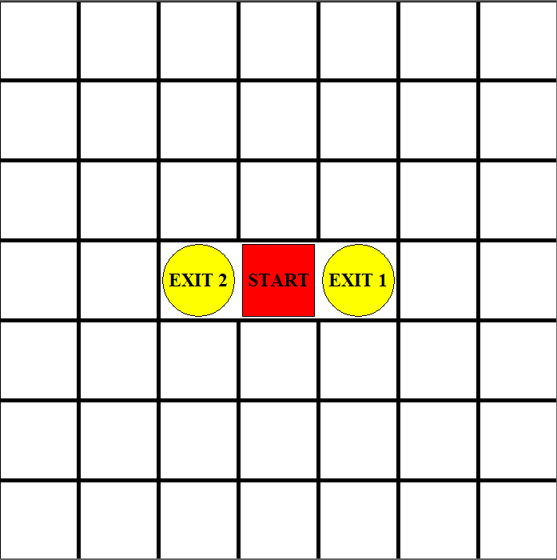
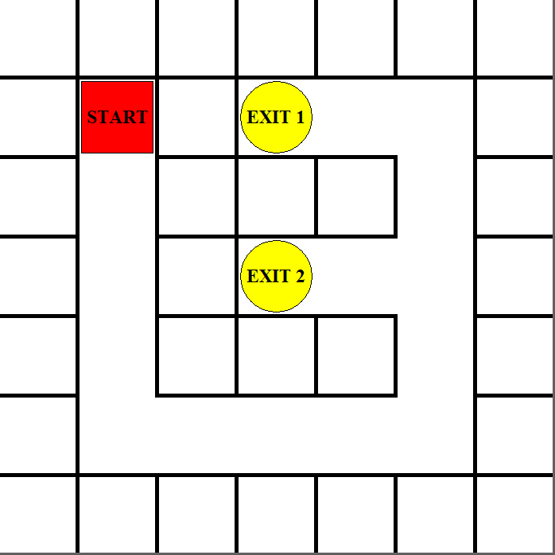
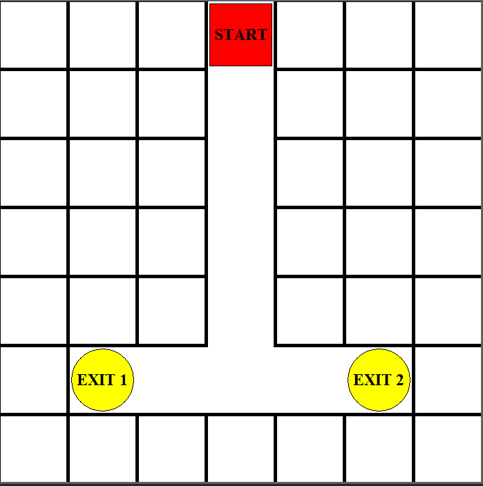
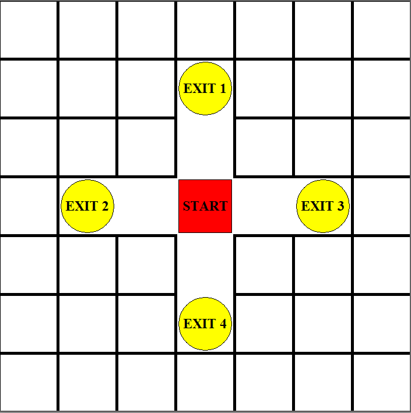
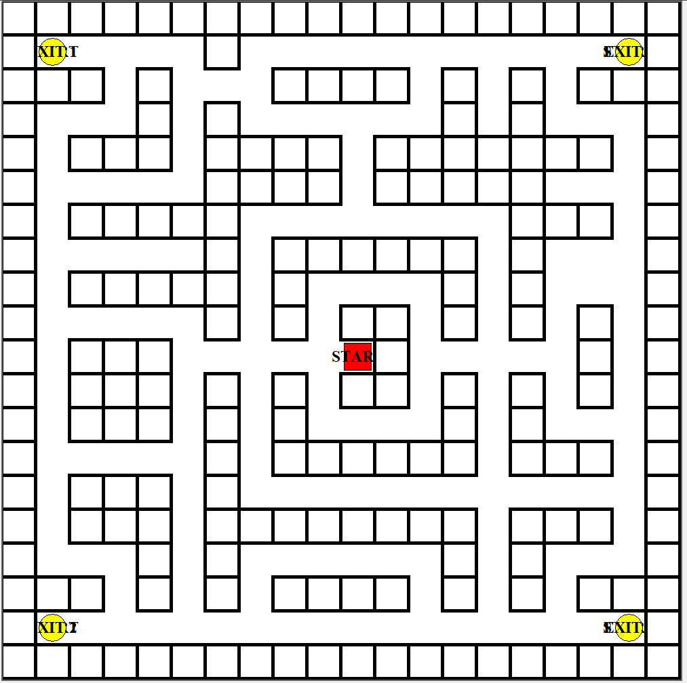

# Finding Eulerian Tours in Mazes Using a Memory-Augmented Fixed Policy Function

This repository explores a novel memory-augmented tabular Q-learning approach designed to navigate mazes with dynamic exit locations. This approach addresses significant challenges to traditional Q-learning algorithms by enhancing adaptability and efficiency in maze-solving agents without the computational complexity typically associated with recurrent neural network (RNN) structures.

## Overview

Maze navigation is a fundamental problem in reinforcement learning (RL), providing a framework to investigate the exploration-exploitation trade-off. Traditional Q-learning methods often struggle in dynamic environments where conditions, such as exit locations, change. This project develops and validates a memory-augmented tabular Q-learning algorithm, allowing agents to adapt their strategies based on stored experiences.

### Key Contributions

- Development of a memory-augmented tabular Q-learning algorithm that maintains adaptability in dynamic maze environments.
- Integration of an external memory mechanism enabling efficient backtracking and exploration of alternative routes.
- Comparison of the proposed algorithm against traditional Q-learning and other advanced RL algorithms, demonstrating superior performance in navigating mazes with randomized exits.

## Visual Representations of Mazes

The following mazes were used in the experiments:

*Figure: Visual representation of the mazes used for the experiment.*

## Advancements and Challenges in Memory-Based Learning Systems

Integrating memory-based learning systems within RL has become crucial for efficiently navigating complex environments. This chapter discusses the emergence of Deep Reinforcement Learning (DRL) and the associated challenges in partially observable environments where memory systems play a pivotal role.

### Memory-Based Systems in Reinforcement Learning

- **Nearest-Neighbor Searches**: Optimize decision-making by finding relevant past experiences.
- **Space Decomposition Methods**: Break down complex environments for better exploration and exploitation.
- **Hierarchical Clustering**: Organize experiences based on relationships for efficient information retrieval.

The proposed method contrasts with neural network-embedded memory systems by emphasizing simplicity and adaptability.

### Deep Reinforcement Learning in Partially Observable Environments

The chapter introduces a memory-augmented tabular Q-learning algorithm that effectively addresses the challenges of dynamic mazes with randomized exit locations. This innovation allows the agent to adjust its policy in response to changes, showcasing improved adaptability and problem-solving capabilities.

### Contributions to the Reinforcement Learning Domain

The memory-augmented approach enhances adaptability and efficiency in maze navigation. While it presents significant advancements, limitations related to increased state space and learning complexity must be considered. Future research will explore optimizations and applications in more dynamic settings.

## Environment and Agent Definitions

The maze is represented by a matrix \(M\) of binary values, where \(1\) denotes blocked cells and \(0\) denotes open cells. The maze is defined as having a discrete state space \(\mathbb{S}\) and action space \(\mathbb{A}\).

- **Example Maze Representation**:

|   |   |   |   |   |   |   |
|---|---|---|---|---|---|---|
| 1 | 1 | 1 | 1 | 1 | 1 | 1 |
| 1 | 0 | 1 | 0 | 0 | 0 | 1 |
| 1 | 0 | 1 | 1 | 1 | 0 | 1 |
| 1 | 0 | 1 | 0 | 0 | 0 | 1 |
| 1 | 0 | 1 | 1 | 1 | 0 | 1 |
| 1 | 0 | 0 | 0 | 0 | 0 | 1 |
| 1 | 1 | 1 | 1 | 1 | 1 | 1 |

## Maze Environment with Memory Modification

A memory vector \(\Vec{\countValue}_{(y,x)}\) is created for each cell in the maze, allowing the agent to track previously taken actions. The agent's state representation is extended to include this memory vector, enhancing its ability to backtrack and explore alternative routes.

## Integrating Memory in Tabular Q-learning

The standard Q-learning algorithm is adapted to work with an augmented state vector \(s_t = (y_t, x_t, \Vec{\countValue}_{(y_t,x_t)})\). The policy function is updated to account for the memory-augmented state representation.

## Experiment Setup

The study compares five algorithms on various maze structures:
- Conventional Q-learning algorithm
- Proximal Policy Optimization (PPO)
- A2C (Asynchronous Advantage Actor-Critic)
- DQN (Deep Q-Network)
- Wall-following Q-learning

Each algorithm is evaluated based on the number of steps taken to reach maze exits.

## Results

Results demonstrate the performance of memory-augmented algorithms compared to traditional methods, as shown in the following table:

| Maze Name                            | $A^*$ Accumulated Steps | Algorithm Method | Accumulated Steps with External Memory | Without External Memory |
|--------------------------------------|-------------------------|------------------|---------------------------------------|-------------------------|
| Small Corridor                       | 4                       | Tabular Q-learning | **4.0** $\pm$ 0.0                     | 501.0 $\pm$ 0.0        |
| Long Corridor Maze                  | 30                      | Tabular Q-learning | **30.4** $\pm$ 0.4                    | 902.6 $\pm$ 64.93      |
| T-shaped Maze                       | 16                      | Tabular Q-learning | **16.0** $\pm$ 0.0                     | 703.6 $\pm$ 80.67      |
| Cross Maze                          | 32                      | Tabular Q-learning | **32** $\pm$ 0.0                       | 1701.2 $\pm$ 81.32     |
| Complex Looped Maze                 | 232                     | Tabular Q-learning | **390.8** $\pm$ 124.9                   | 1951.7 $\pm$ 48.3      |

## Discussion

The results show that the memory-augmented Q-learning algorithm outperforms traditional Q-learning methods in navigating mazes with dynamic exit locations. The ability to backtrack and explore new paths significantly enhances performance, highlighting the effectiveness of integrating memory into Q-learning frameworks.

## Chapter Conclusions

This chapter presents a viable alternative to RNN-based maze navigation approaches by demonstrating the efficacy of a memory-augmented tabular Q-learning algorithm. The findings highlight the potential for simpler, more computationally efficient solutions to enhance RL agents' adaptability and problem-solving capabilities in dynamic environments.

